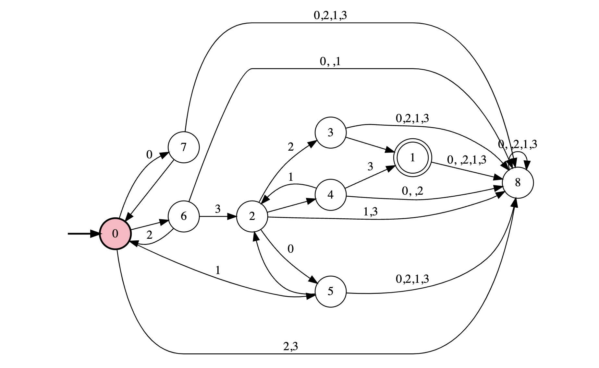

# rm-compiler

## High-level language grammar:

- program ::= { statement }
- statement ::= "BLOCK" "WHILE" formula nl |   "PROP" ident nl
- formula ::= ident "==" ( "TRUE" | "FALSE" )

## Usage
The soure code file used in the example is "machine.rm" which encodes the tasks of delivering coffee
to the office.

Command to run compiler:
```bash
rm-compiler git:main*  
(rm-compiler-py3.11) ❯ python3 src/main.py machine.rm
```

Expected output:
```bash
rm-compiler git:main*  
(rm-compiler-py3.11) ❯ python3 src/main.py machine.rm
Compiler started.

Proposition coffee declared, index in proposition set P: 0
Proposition office declared, index in proposition set P: 1

Truth table containing the elements of the powerset of P (this set is the input alphabet to the reward machine):
Alphabet symbol: 0      Proposition assigments: [False, False]
Alphabet symbol: 1      Proposition assigments: [True, False]
Alphabet symbol: 2      Proposition assigments: [False, True]
Alphabet symbol: 3      Proposition assigments: [True, True]

Output regular expression: (0 + 2)*(1 + 3)(0 + 1)*(2 + 3)
```

## Output handling

The resulting regular expression can be used to generate the corresponding DFA using: https://ivanzuzak.info/noam/webapps/fsm_simulator/

Output RE: (0 + 2)\*(1 + 3)(0 + 1)\*(2 + 3)

Generated DFA:





